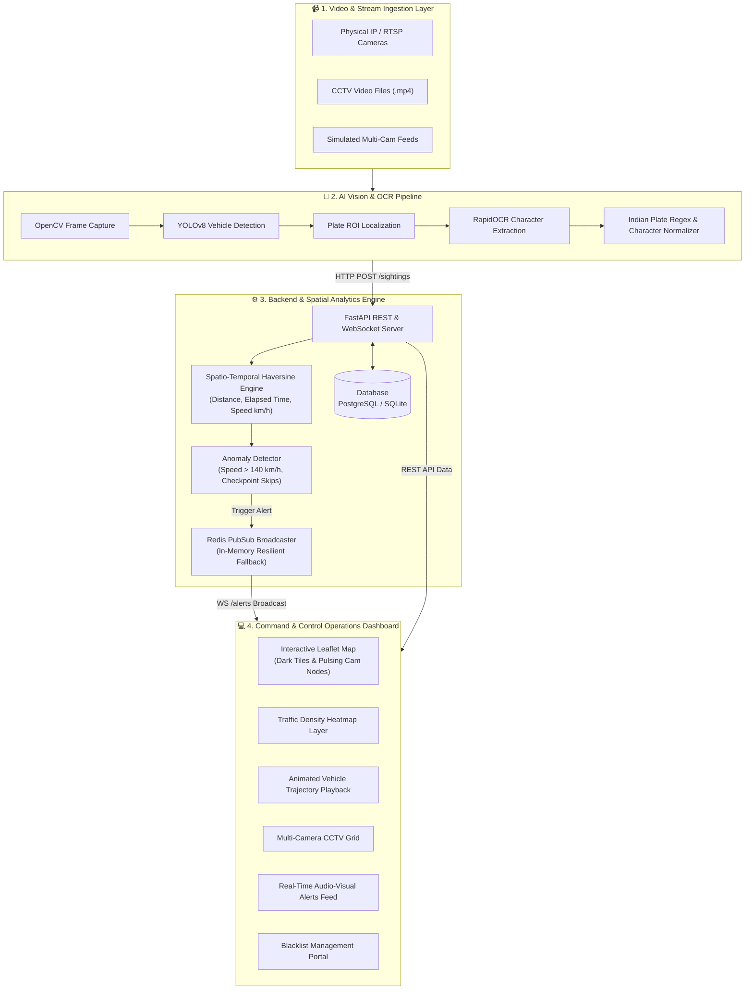

# 🛡️ City-Wide ANPR Vehicle Tracking & Surveillance System

[](https://fastapi.tiangolo.com)
[](https://react.dev)
[](https://www.typescriptlang.org)
[](https://docs.ultralytics.com)
[](https://opencv.org)
[](LICENSE)

An enterprise-grade, end-to-end **Automatic Number Plate Recognition (ANPR) and Spatio-Temporal Vehicle Tracking Platform**. The system ingests distributed CCTV/RTSP camera feeds, detects license plates in real-time, reconstructs vehicle trajectories across city checkpoints, computes velocity and route anomalies via spatial algorithms, and broadcasts instant audio-visual security alerts over WebSockets.

---

## 🏛️ System Architecture Diagram



---

## 📋 Key Features

- **Real-Time ANPR Engine**: Powered by Ultralytics YOLOv8 and RapidOCR for high-precision vehicle detection and plate character recognition.
- **Indian Standard Plate Normalizer**: Robust regex validation (`^[A-Z]{2}[0-9]{1,2}[A-Z]{1,3}[0-9]{4}$`) with heuristic OCR character confusion correction ($O \leftrightarrow 0, I \leftrightarrow 1$).
- **Spatio-Temporal Trajectory Reconstruction**: Chronological journey mapping across city camera nodes with breadcrumbs and timing metrics.
- **Speed & Route Anomaly Detection**: Automatic speed computation between camera checkpoints using Haversine distance formulas.
- **WebSocket Alert Broadcast**: Instant push notifications with audio chime on blacklist hits or speed violations.
- **Interactive Dark-Mode Dashboard**: Built with React 19, TypeScript, Leaflet, and a high-aesthetic Cyberpunk Ops theme.

---

## 🚀 Step-by-Step Execution Guide

### 1. Prerequisites
- **Python 3.10+** (Tested on Python 3.12)
- **Node.js 18+** & **npm**

---

### 2. Backend Setup & Startup

1. Open a terminal and navigate to the backend directory:
   ```bash
   cd "f:\ANPR CAM\backend"
   ```

2. Install Python dependencies:
   ```bash
   pip install -r requirements.txt
   ```

3. Start the FastAPI backend server:
   ```bash
   python -m uvicorn app.main:app --host 0.0.0.0 --port 8000 --reload
   ```

> 🟢 **Backend will be live at:** [http://localhost:8000](http://localhost:8000)  
> 📖 **Interactive Swagger API Docs:** [http://localhost:8000/docs](http://localhost:8000/docs)

---

### 3. Frontend Setup & Startup

1. Open a second terminal and navigate to the frontend directory:
   ```bash
   cd "f:\ANPR CAM\frontend"
   ```

2. Install Node dependencies:
   ```bash
   npm install
   ```

3. Start the Vite development server:
   ```bash
   npm run dev -- --host 0.0.0.0 --port 5173
   ```

> 🌐 **Open the Dashboard in your browser:** [**http://localhost:5173**](http://localhost:5173)

---

### 4. (Optional) Run the AI ANPR Pipeline on Video Feeds

To run the computer vision and OCR engine on CCTV video clips:

1. Open a third terminal and navigate to the pipeline directory:
   ```bash
   cd "f:\ANPR CAM\pipeline"
   ```

2. Install computer vision dependencies:
   ```bash
   pip install -r requirements.txt
   ```

3. Generate sample synthetic multi-camera CCTV video clips (if not already generated):
   ```bash
   python sample_generator.py
   ```

4. Run the video ingestion and detection processor:
   ```bash
   python video_processor.py
   ```

---

## 🎮 Interactive Demo Traces (Try in Dashboard)

Use the search bar on [http://localhost:5173](http://localhost:5173) or click the demo chips:

| License Plate | Demo Scenario | Expected System Response |
| :--- | :--- | :--- |
| `DL01AB1234` | **Standard Journey** | Traces multi-checkpoint route from MG Road $\rightarrow$ Koramangala. |
| `MH12DE1433` | **Blacklisted Vehicle** | Instant 🔴 **RED ALERT** banner, audio chime, and wanted status flag. |
| `KA05MB4567` | **Speed Violation** | Triggers ⚡ **SPEED ANOMALY** alert ($>140\text{ km/h}$). |
| `TN09BZ9999` | **Checkpoint Skip** | Flags ⚠️ **ROUTE SKIP** anomaly between non-adjacent cameras. |

---

## 🔌 API & WebSocket Endpoints Reference

| Method | Endpoint | Description |
| :--- | :--- | :--- |
| `GET` | `/cameras` | Fetch all registered CCTV camera nodes and GPS coordinates. |
| `GET` | `/trajectory/{plate}` | Fetch vehicle journey with speed and anomaly analysis. |
| `GET` | `/heatmap` | Fetch aggregated traffic density points for the map layer. |
| `GET` | `/blacklist` | List all blacklisted/flagged vehicles. |
| `POST` | `/blacklist` | Add a new vehicle to the blacklist (`{plate, reason}`). |
| `DELETE` | `/blacklist/{plate}` | Remove a vehicle from the blacklist. |
| `GET` | `/sightings/recent` | Fetch latest camera detections. |
| `POST` | `/sightings` | Record new plate sighting (triggers alerts). |
| `GET` | `/stats` | Overall system telemetry and camera counts. |
| `WS` | `/alerts` | WebSocket live stream for instant alert dispatch. |

---

## 📂 Project Directory Structure

```
f:/ANPR CAM/
├── backend/                        # FastAPI REST API & Spatial Analytics
│   ├── app/
│   │   ├── main.py                 # App entry point, CORS, lifespan & WebSocket
│   │   ├── config.py               # Settings & environment configuration
│   │   ├── database.py             # SQLAlchemy database engine
│   │   ├── models.py               # Camera, Sighting, Blacklist models
│   │   ├── schemas.py              # Pydantic request/response schemas
│   │   ├── spatial.py              # Haversine distance, speed & anomaly math
│   │   ├── pubsub.py               # Redis PubSub / in-memory alert broadcaster
│   │   ├── seed_data.py            # Initial seed data for cameras & sightings
│   │   └── routes/                 # Endpoint handlers (cameras, trajectory, etc.)
│   └── requirements.txt
├── pipeline/                       # Computer Vision, OCR & Video Ingestion
│   ├── detector.py                 # YOLOv8 vehicle detection + RapidOCR pipeline
│   ├── plate_validator.py          # Indian plate regex & OCR character correction
│   ├── sample_generator.py         # CCTV video generator with moving cars & plates
│   ├── video_processor.py          # Multi-camera stream ingestion runner
│   ├── demo_videos/                # Synthesized sample CCTV video clips (.mp4)
│   └── requirements.txt
├── frontend/                       # React 19 + TypeScript + Leaflet Dashboard
│   ├── src/
│   │   ├── App.tsx                 # Main application layout
│   │   ├── components/
│   │   │   ├── Navbar.tsx          # Telemetry header with live clock & quick stats
│   │   │   ├── MapView.tsx         # Leaflet map with dark tiles, nodes & heatmap
│   │   │   ├── TrajectoryPlayer.tsx # Animated path player with speed stats
│   │   │   ├── AlertsPanel.tsx     # WebSocket live alerts with sound toggle
│   │   │   ├── CameraFeedGrid.tsx  # Multi-camera CCTV surveillance cards
│   │   │   └── BlacklistModal.tsx  # Flagged vehicle management
│   │   └── services/               # REST API & WebSocket client services
│   └── package.json
├── PROJECT_OVERVIEW_AND_UPGRADE_GUIDE.md # Production upgrade roadmap
└── README.md                       # This comprehensive documentation
```

---

## 🔒 License
This project is open-source and available under the [MIT License](LICENSE).
